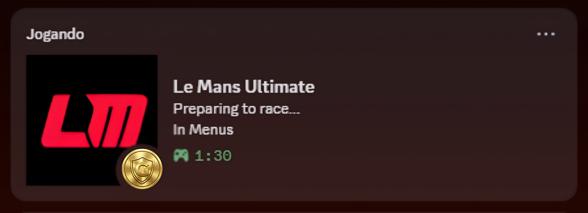

# LMU RPC Mod

[🇺🇸 English](README.md) | [🇧🇷 Português](README.pt-br.md)

**LMU RPC Mod** es una aplicación independiente que lleva **Discord Rich Presence** a **Le Mans Ultimate**. Muestra a tus amigos exactamente qué estás conduciendo, dónde y tu posición, con actualizaciones en tiempo real y detección automática.

## 📸 Vistas Previas (Previews)

Mira cómo aparecerá tu estado en Discord en diferentes situaciones de juego:

  
  
  

### 🛡️ Safety Rating Dinámico
El pequeño icono en la esquina de la imagen refleja automáticamente tu **Clasificación de Seguridad (Rank)** actual en el juego. El mod detecta tu licencia y muestra la insignia correspondiente:

| Bronce | Plata | Oro | Platino |
| :---: | :---: | :---: | :---: |
|  |  |  |  |

##  Características

*   **Detección Automática:** Identifica instantáneamente Coche, Pista, Clase y Tipo de Sesión.
*   **Estado Inteligente:** Muestra "En los Menús", "Clasificación", "Carrera" o "Práctica".
*   **Telemetría en Tiempo Real:** Muestra Vuelta actual, Posición y Tiempo Restante.
*   **Multi-Idioma:** Totalmente traducido al Español, Inglés y Portugués (Detectado automáticamente).
*   **Inicio Automático:** Opción para iniciar junto con Windows.
*   **Cero Configuración:** Solo abre y juega. No requiere configuración manual de IP o puerto.

## 📥 Instalación

1.  Ve a la página de [**Releases**](https://github.com/uWaazy/LMU-RPC-Mod/releases).
2.  Descarga el archivo `.zip` más reciente (ej: `LMU_RPC_v1.0.zip`).
3.  Extrae el archivo en cualquier lugar de tu PC.
4.  Ejecuta `LMU_RPC_v1.0.exe`.
5.  ¡Abre **Le Mans Ultimate** y disfruta!

## 🛠️ Proyectos Relacionados

Echa un vistazo a **LMU Tools**, una aplicación de escritorio multifuncional diseñada para ayudar a los pilotos a optimizar sus configuraciones de coche y estrategias de carrera de forma rápida e intuitiva.

## 🤝 Soporte y Feedback

¿Encontraste un error? ¿Tienes una sugerencia? ¡Únete a nuestro servidor de Discord!

---

**Desarrollado por uWaazy**

