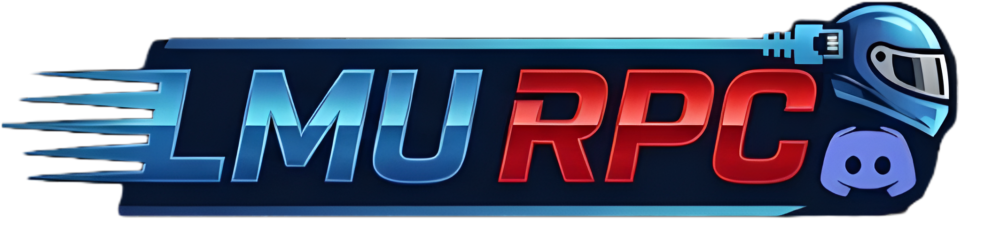

# LMU RPC Mod

[🇺🇸 English](README.md) | [🇪🇸 Español](README.es.md)

**LMU RPC Mod** é uma aplicação independente que traz o **Discord Rich Presence** para o **Le Mans Ultimate**. Mostre aos seus amigos exatamente o que você está pilotando, onde e sua posição, com atualizações em tempo real e detecção automática.

## 📸 Visualização (Previews)

Veja como seu status aparecerá no Discord em diferentes situações de jogo:

  
  
  

### 🛡️ Safety Rating Dinâmico
O ícone pequeno no canto da imagem reflete automaticamente a sua **Classificação de Segurança (Rank)** atual no jogo. O mod detecta sua licença e exibe o emblema correspondente:

| Bronze | Prata | Ouro | Platina |
| :---: | :---: | :---: | :---: |
|  |  |  |  |

## 🚀 Funcionalidades

* **Detecção Automática:** Identifica instantaneamente Carro, Pista, Classe e Tipo de Sessão.
* **Status Inteligente:** Mostra "Nos Menus", "Qualificação", "Corrida" ou "Treino".V
* **Telemetria em Tempo Real:** Exibe Volta atual, Posição e Tempo Restante.
* **Safety Rating:** O ícone de status muda conforme seu Rank (Bronze, Prata, Ouro, Platina).
* **Multi-Idioma:** Totalmente traduzido para Português, Inglês e Espanhol (Detectado automaticamente).
* **Início Automático:** Opção para iniciar junto com o Windows.
* **Zero Configuração:** Basta abrir e jogar. Nenhuma configuração manual de IP ou porta necessária.

## 📥 Instalação

1.  Vá para a página de [**Releases**](https://github.com/uWaazy/LMU-RPC-Mod/releases).
2.  Baixe o arquivo `.zip` mais recente (ex: `LMU_RPC_v1.0.zip`).
3.  Extraia o arquivo em qualquer lugar do seu PC.
4.  Execute o `LMU_RPC.exe` e Inicia RPC pelo app.
5.  Abra o **Le Mans Ultimate** e divirta-se!

## 🛠️ Projetos Relacionados

Conheça o **LMU Tools**, uma aplicação desktop multifuncional projetada para ajudar pilotos a otimizar seus setups de carro e estratégias de corrida de forma rápida e intuitiva.

## 🤝 Suporte e Feedback

Encontrou um bug? Tem uma sugestão? Junte-se ao nosso servidor no Discord!

---

**Desenvolvido por uWaazy**

